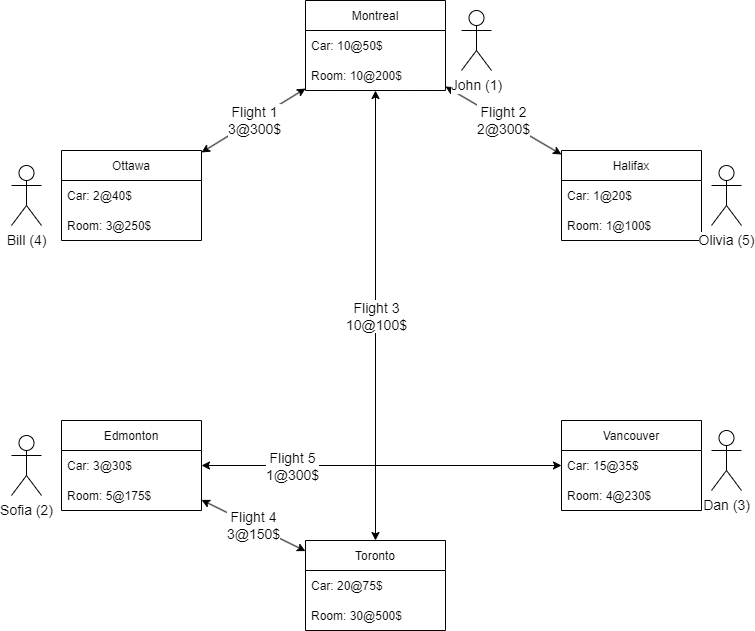

# comp512-project group 50

## References
[TCP Communication Guidelines](TCPFormat.md)

## Testing
Input file [world.txt](Client/world.txt)


## To run the RMI resource manager:
### Unix
```
cd Server/
./run_server.sh [<rmi_name>] # starts a single ResourceManager
./run_servers.sh # convenience script for starting multiple resource managers
```
### Windows
```
cd Server\
run_server [<rmi_name>] # starts a single ResourceManager
run_servers # convenience script for starting multiple resource managers
```

## To run the middleware
### Unix
```
cd Server/
./run_middleware.sh [<Flight RM Host>] [<Car RM Host>] [<Room RM Host>]
```
### Windows
```
cd Server\
run_middleware [<Flight RM Host>] [<Car RM Host>] [<Room RM Host>]
```

## To run the RMI client:
### Unix
```
cd Client
./run_client.sh [<server_hostname> [<server_rmi_name>]]
```
### Windows
```
cd Client\
run_client [<server_hostname> [<server_rmi_name>]]
```
