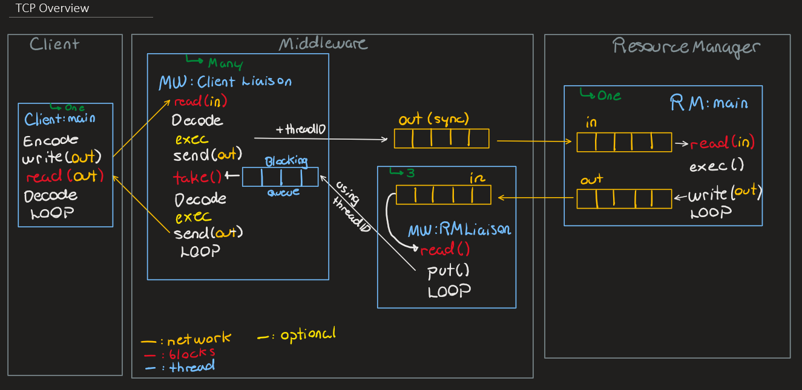

# TCP Architecture

See [TCPFormat.md](TCPFormat.md) for all message (`Vector<Object>`) serialization/deserialization.

## Client
The client starts by creating a `ClientSocket` and connecting to the middleware on a given host and hardcoded port (7050). An "adapter" `IResourceManager` (`TCPIResourceManager.java`) is given to the client so that little change needs to be done. The `TCPIresourceManager` converts calls to its methods to messages sent over the buffer in the form of a serialized `Vector<Object>` `["methodName", arg1, arg2, ...]`. It then blocks and waits for a reply in the form of `[returnObject, isRemoteException]` that it can interpret and return.

## Middleware
The TCP middleware can be separated into three components: __main thread, client liaison threads and resource manager liaison threads__.

### Main Thread
The main thread waits and connects to the resource managers by creating a RM liaison thread (`TCPRMLiaison.java`) for each resource manager. The hosts are given as argument and ports hardcoded (flight: 7051, car: 7052, room, 7053) to allow them to be on the same host. After it has connected to each resource managers, it starts each RM liaison thread. 

Once connection with RMs are established, the main thread creates a `ServerSocket` at port 7050 and enters a loop. Each time a client connects (`ServerSocket#accept()`), the returned `Socket` is used to create a new client liaison thread (`TCPClientLiaison`) which is started and indexed in a map `clientLiaisonMap`.

Creating client liaison threads and resource manager threads allows the main thread to continue accepting new client connections without blocking. It also allows the middleware to be non blocking as while a client liaison thread may block while waiting for a reply, other client liaison threads can continue working.

### Client Liaison Threads
Client liaison threads take care of all communications between __one__ client and the middleware. They are created by the main thread and given the `ObjectOutputStream` and `ObjectInputStream` linking to the client in addition of an `threadID`. All messages outbound to resource managers are done by simply writing serialized `Vector<Object>`s into the `ObjectOutputStream` leading to the RM.

After sending a message to a RM, the client liaison thread will immediately block by trying to read from an empty size 1 `BlockingQueue`. Once the RM responds, its assigned RM liaison thread will use the thread ID attached to the message to put the response message into the appropriate client liaison thread's queue, at which point it will unblock.

In a loop, client liaison threads will deserialize a message (`Vector<Object>`) from the client and figure out which method call it was requesting using the 0th argument. If the method:
* __[Only concerns flight/car/room]__: the CLiaison thread will append its thread ID to the message and send it over to the appropriate RM using `sendMessage()` and wait for a reply.
* __[Only concerns customers]__: Call the corresponding method on the middleware (extends `ResourceManager`).
* __[Mix]__: Call a modified version of the corresponding method that will handle parts concerning customers locally and parts involving a resource by sending/receiving messages to the appropriate resource manager.

__This is very similar to RMI__

Once a reply is received, it will extract the return object resulting from the corresponding method call, and box it in a new `Vector<Object>` `[returnObject, isException]` that it sends back to the client.

### Resource Manager Liaison Threads

Resource manager liaison threads take care of listening for incoming messages from a resource manager and figuring out to which client liaison thread it is destined to in a loop. It can do so because the client liaison thread will have included its `threadID` in the message to the RM and this `threadID` is present in the reply. The RM liaison thread simply puts the message in the right client liaison thread's `BlockingQueue`.

This implementation allows the middleware to be non blocking while waiting for RM replies.

## Resource Managers

Resource managers will connect to the middleware by creating a `ServerSocket` and waiting for the middleware to connect (`accept()`). Once it gets an `ObjectInputStream` and `ObjectOutputStream` to the server, it waits for messages in a loop.

All messages (`Vector<Object>`) will correspond to a method call request with the name of the method at index 1, followed by the arguments afterwards. Once the requested method has been run, it boxes the return value into a new message `[threadID, returnObject, isException]` and sends it back to the middleware.
